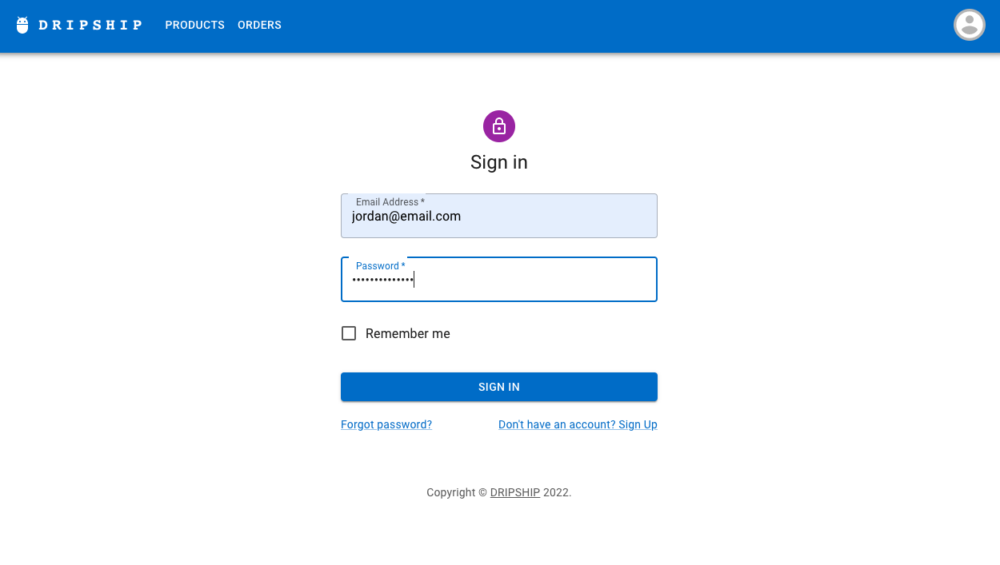
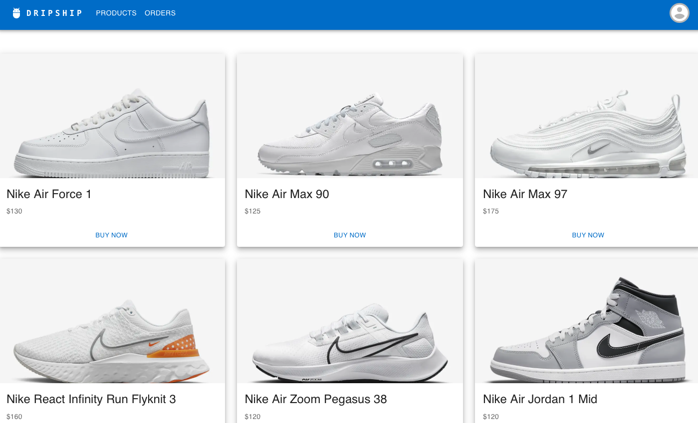
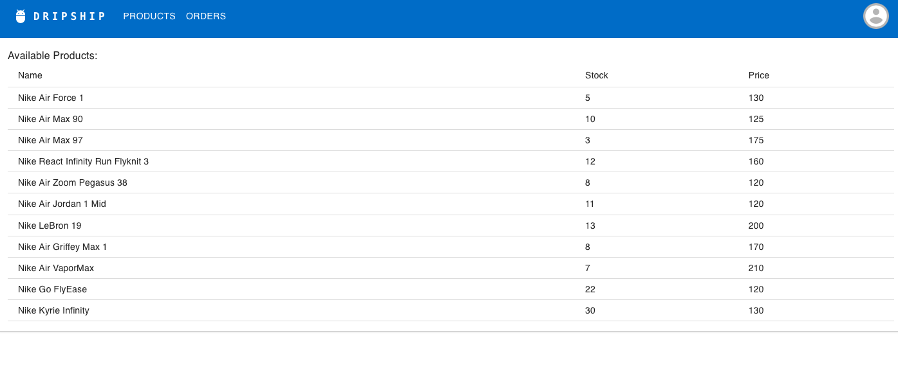
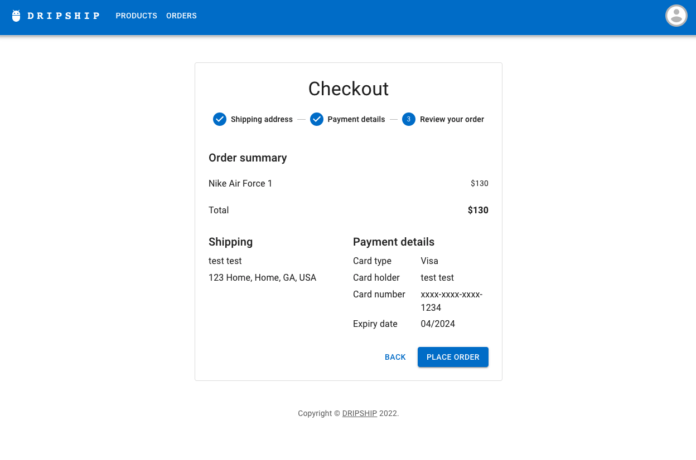
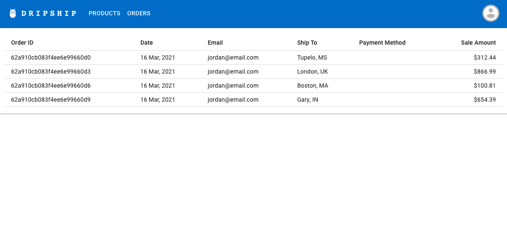

# Dripship CRM
Want to sell products or goods but don’t want to handle warehousing and shipping? Welcome to Dripship CRM, where you can view and manage products, orders and inventory with the click of a button! 

## Description
Dripship CRM is a Full-stack MERN application that assists users with processing orders that should be drop shipped to customers from a warehousing facility.

## Preview 

## Links
* Deployed App Heroku: https://dropship-crm.herokuapp.com/ 
* Repo: https://github.com/jorross/DropShip-P3.git 

## License

  
- created by Dropship Like It's Hot 2022
